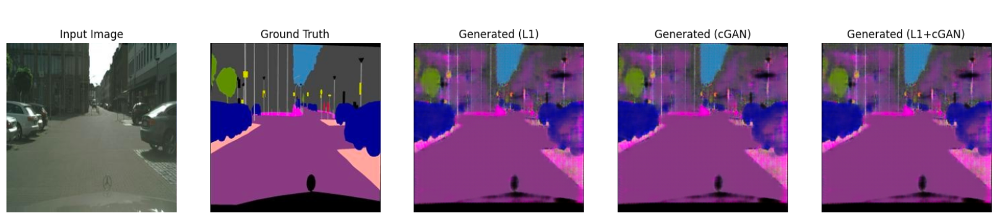
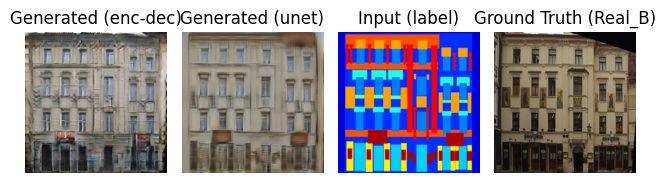
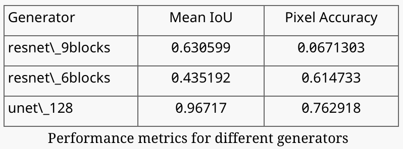
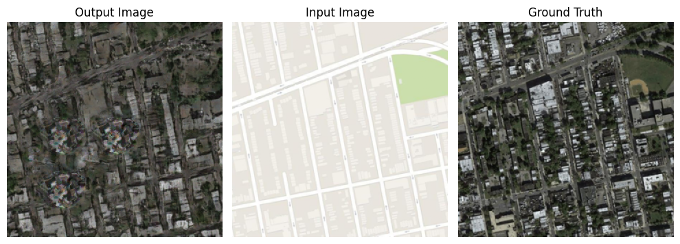
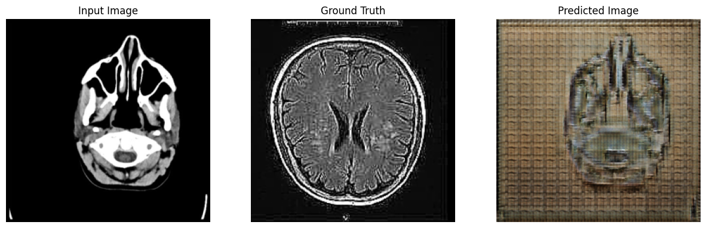

# EE6180_Practical_Assignment

### Replication of experiments done in tge paper.
experiments.ipynb file contains the code for replicating the experiments conducted in the paper.

Experiment 1

Experiment 1 is to test the model performance for different Loss functions on semantic segmentation task. The equivalent experiment result for this can be found in Figure 10 and Table 6 of the original paper.  The cityscape dataset can be downloaded from https://cityscapes-dataset.com, the datasets used are - [gtFine\_trainvaltest.zip] and [leftImg8bit\_trainvaltest.zip]

Experiment 2}

Experiment 2 is to test the model performance for different generator architecture on label to image generation task. The equivalent experiment result for this can be found in Figure 14 of the original paper.  The dataset used for this experiment is CMP Facades. The model performance is shown in Table 2.

\subsection{Experiment 3}

 The follow result shows the image transformation of Google Maps dataset, to convert the normal map layout to satellite layout. The result is shown in Figure 3.

 

 ### Performing New Experiments:

New Experiment 1

Generalization to unseen domains:
In this experiment, I will test the adaptability of the framework to entirely new tasks such as medical image translation. I am using the pre-trained model by importing the checkpoints and testing it on a CT to MRI scan dataset. 

Now, I have finetuned the model by freezing first 5 layers and training for 40000 steps with the medical image dataset. One more challenging task is that there is no paired dataset for training. But the model architecture was made for paired dataset. I was curious to know how does the U-Net architecture (generator) and the patch-GAN (discriminator) works with unpaired data, since the architecture is very similar to Cycle GANs in terms of architecture.

New Experiment 2

Zero Shot and few shot Translation:
In this experiment, I have trained the model on a different task (label to image with facades dataset) and tested on a different task (semantic label to image on cityscape dataset).

New Experiment 3

I conducted an experiment to evaluate the robustness of the model to noisy inputs. Added mixed dataset while training, where I manually created a dataset folder containing dataset from all tasks tested so far (semantic labels to image generation, semantic segmentation, image to sketch translation) and then tested the model performance. The model performed well on test dataset (Facades), as while training, I used data augmentation such as jittering, flipping and random cropping. 

