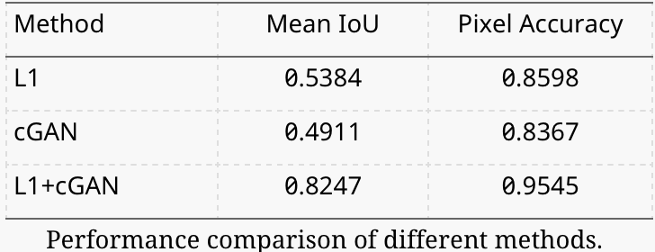

# EE6180_Practical_Assignment

## This assignment is based on the paper "Image-to-Image Translation with Conditional Adversarial Networks"
Link to the paper: https://arxiv.org/pdf/1611.07004
Acknowledgement: {isola,junyanz,tinghuiz,efros}@eecs.berkeley.edu

### 1. Replication of experiments done in tee paper.
This repository contains four main python notebook files.

1. experiments.ipynb: This file contains the code to replicate the three main experiments done by the authors in the paper. For running this file, you need to have the original pytorch repository. https://github.com/junyanz/pytorch-CycleGAN-and-pix2pix
Make sure that this experiments.ipynb file is kept inside the original pytorch repository after cloning it.

2. replicate_experiments.ipynb: This is a tensorflow implementation of the pix2pix model from scratch, where the code and instruction for conducting each experiment is mentioned in this single ipynb file. The additional experiments 3.2 and 3.3 can be done in the same file by changing the dataset directory and training accordingly.

3. eval_scores.ipynb: This file contains code specifically for evaluating the model performance on various datasets to obtain average IoU scores, pixel wise accuracy and FCN scores. I have given the code for each type of dataset in individual cells just to look at different results at the same time even without running the codes.

4. additional_exp1.ipyb: This file contains the code to conduct the first additional experiment. This file is separate because, the dataset was much different in structure than the usual pix2pix datasets. I have used CT scan and MRI scan image datasets. 

Apart from these files, there is a pix2pix.ipynb file which is the source code provided by the authors, just for reference.
Experiment 1: Analysis of the objective function

Experiment 1 is to test the model performance for different Loss functions on semantic segmentation task. The equivalent experiment result for this can be found in Figure 10 and Table 6 of the original paper.  The cityscape dataset can be downloaded from https://cityscapes-dataset.com, the datasets used are - [gtFine\_trainvaltest.zip] and [leftImg8bit\_trainvaltest.zip]

Experiment 2: Analysis of the Generator Architecture

Experiment 2 is to test the model performance for different generator architecture on label to image generation task. The equivalent experiment result for this can be found in Figure 14 of the original paper.  The dataset used for this experiment is CMP Facades. The model performance is shown in Table 2.

Experiment 3: From PixelGANs to PatchGANs to ImageGANs

 In this experiment, basically we change the receptive field for the discriminator and check the per-
formance on three different receptive fields. The following result shows the image transformation of
Google Maps dataset, to convert the normal map layout to satellite layout, for patch discriminator (with
highest receptive field (kernel sizes 7). All the images shown in previous results were generated at default
receptive fields (with kernel sizes 4). The result is shown in Figure 3.

 

 ### Performing New Experiments:

New Experiment 1

Generalization to unseen domains:
In this experiment, I will test the adaptability of the framework to entirely new tasks such as medical image translation. I am using the pre-trained model by importing the checkpoints and testing it on a CT to MRI scan dataset. Link to the dataset: https://www.kaggle.com/datasets/darren2020/ct-to-mri-cgan

Now, I have finetuned the model by freezing first 5 layers and training for 40000 steps with the medical image dataset. One more challenging task is that there is no paired dataset for training. But the model architecture was made for paired dataset. I was curious to know how does the U-Net architecture (generator) and the patch-GAN (discriminator) works with unpaired data, since the architecture is very similar to Cycle GANs in terms of architecture.

New Experiment 2

Zero Shot and few shot Translation:
In this experiment, I have trained the model on a different task (label to image with facades dataset) and tested on a different task (semantic label to image on cityscape dataset).

New Experiment 3

I conducted an experiment to evaluate the robustness of the model to noisy inputs. Added mixed dataset while training, where I manually created a dataset folder containing dataset from all tasks tested so far (semantic labels to image generation, semantic segmentation, image to sketch translation) and then tested the model performance. The model performed well on test dataset (Facades), as while training, I used data augmentation such as jittering, flipping and random cropping. 

